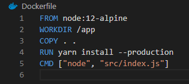
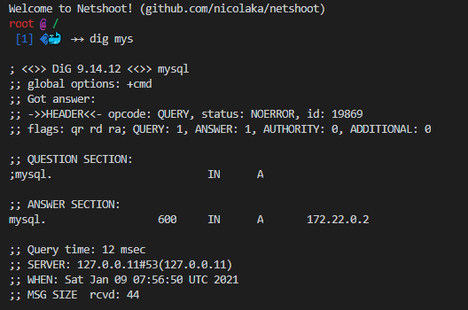
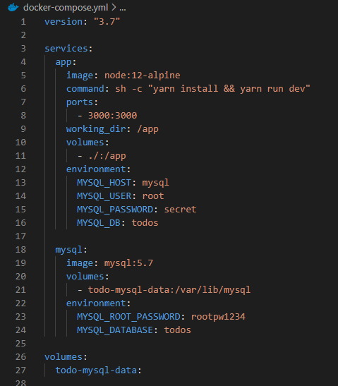

<link rel="stylesheet" type="text/css" href="doc/css/tailwind.css" />
<link rel="stylesheet" type="text/css" href="doc/css/style.css" />

<p class="text-6xl border-b pb-2 mb-3 border-blue-500">Docker</p>

<h1 class="text-2xl border-b py-2 my-3"> Tutorial Container </h1>

Docker stellt einen Tutorial Container bereit, welcher über einen Webserver eine Anleitung für ein Testprojekt enthält.
Dieser Container wird folgendermaßen gestartet:

<div class="my-3">

```console
user@pc:~/$ docker run -d -p 80:80 docker/getting-started
```
</div>

# Files des Projektes
Die Codefiles für das Testprojekt können über den Server des erstellten Tutorial Container über http://127.0.0.1/assets/app.zip heruntergeladen werden. Diese sollten dann in einen Projektordner extrahiert werden.

<h1 class="text-2xl border-b py-2 my-3"> Dockerfile </h1>
Das Dockerfile beinhalted die Anweisungen zum erstellen eines Images.

</img>

Um das Image zu erstellen muss man dieses "bauen".

<div class="my-3">

```console
user@pc:~/$ docker build -t getting-started .
```
</div>
Anschließend kann ein Container auf basis dieses Images erstellt werden.

<div class="my-3">

```console
user@pc:~/$ docker run -dp 3000:3000 getting-started
```
</div>

# Änderungen
Bei änderungen muss beim aktuellen stand das Image neu gebaut werden. Wenn mann danach versucht den Container mit dem selben Kommando wie oben nochmal zu ersstellen bekommt man eine Fehlermeldung, da dieser nicht den selben Port belegen kann.

Um den Container zu erstellen muss der vorherige gestoppt oder gelöscht werden.

<h1 class="text-2xl border-b py-2 my-3"> Verwalten von Containern </h1>

Das Verwalten kann über die GUI von Docker-Desktop, oder über die Kommandzeile vorgenommen werden.

Mithilfe des docker ps Kommandos kann man die ID des Containers herausfinden.
<div class="my-3">

```console
user@pc:~/$ docker ps
```
</div>

Anschließend kann man diesen stoppen.
<div class="my-3">

```console
user@pc:~/$ docker stop <the-container-id>
```
</div>

Wenn dieser gestoppt ist kann man ihn löschen.
<div class="my-3">

```console
user@pc:~/$ docker rm <the-container-id>
```
</div>

<h1 class="text-2xl border-b py-2 my-3"> Docker Hub </h1>
Docker Hub stellt Öffentliche Images zur verfügung und erlaubt das hochladen von eigenen Images.

Wenn man ein Image hochladen will kann das durch den Push-Kommand erledigt werden.
<div class="my-3">

```console
user@pc:~/$ docker push <user>/<image-name>:<tag-name>
```
</div>

Jedoch muss das Image zuerst getagged werden, und der User in docker eingelogged sein.

<div class="my-3">

```console
user@pc:~/$ docker tag getting-started YOUR-USER-NAME/getting-started
```
</div>


<h1 class="text-2xl border-b py-2 my-3"> Docker Volumes </h1>
Aktuell werden die Daten bei der neuerstellung des Containers nicht beibehalten, da dessen Filesystem nur im Container vorhanden ist.

<p class="mb-3">Um nun die Daten der Datenbank permanent zu speichern benötigt man ein sogenanntes Volume. Es gibt zwei typen von volume.</p>

# Named Volume
Ein "named volume" wird von Docker verwaltet und man muss sich nur den Namen davon merken, keinen Pfad.

Ein Volume wird mit folgendem Kommando erstellt:
<div class="my-3">

```console
user@pc:~/$ docker volume create todo-db
```
</div>

Nun muss der Container neu erstellt werden, sprich der aktuelle muss zuvor gelöscht werden.
Um beim neuen Container das Volume anzugeben muss das -v Flag verwendet werden.
In diesem Fall sollte der "/etc/todos" Ordner mit dem Volume synchronisiert werden:

<div class="my-3">

```console
user@pc:~/$ docker run -dp 3000:3000 -v todo-db:/etc/todos getting-started
```
</div>

Nun ist die TODO list nichtmehr vom Container abhängig, bzw über die erstellung neuer Container weg erhalten.

<br class="mb-3">

# Bind Mounts
Bind Mounts haben den selben Zweck wie Volumes, nur das die Daten nicht an einem von Docker verwaltetem Platz, sondern an einem bestimmten Pfad im Host-System gespeichert werden. Dabei ist auch das -v Flag zu verwenden, jedoch mit einem Pfad anstelle eines Volumenamen.

<div class="my-3">

```console
user@pc:~/$ docker run -dp 3000:3000 -v "$(pwd)/data:/etc/todos" getting-started
```
</div>

Im Kommando ist $(pwd) im Hostpfad zu erkennen. Dies ermöglicht die Angabe eines Relativen Pfad in den Projektordner

<h1 class="text-2xl border-b py-2 my-3">Multi-Container Apps</h1>
In Docker sollte jeder Container nur eine Aufgabe erfüllen.

Der nächste Schritt ist die erweiterung des Tutorialprogrammes von einer Sqlite auf eine MySql Datenbank.

<br class="mb-3">

# Container Networking
Da jeder Container isoliert läuft mussen die Verbindungen konfiguriert werden.
Ein neues Netzwerk kann über ein CMD erstellt werden:

<div class="my-3">

```console
user@pc:~/$ docker network create todo-app
```
</div>

Nun kann ein MySql Server erstellt werden, der sich in diesem Netzwerk befindet.
<div class="my-3">

```console
user@pc:~/$ docker run -d `
    --network todo-app --network-alias mysql `
    -v todo-mysql-data:/var/lib/mysql `
    -e MYSQL_ROOT_PASSWORD=rootpw1234 `
    -e MYSQL_DATABASE=todos `
    mysql:5.7

```
</div>

Über das -e Flag können Umgebungsvariablen übergeben werden. Dies wird hier verwedet um den MySql Root User und die Datenbank zu Konfigurieren.

Um zu Testen das der MySql Container läuft kann man versuchen im Container sich mit Mysql zu verbinden

<div class="my-3">

```console
user@pc:~/$ docker exec -it <mysql-container-id> mysql -p
```
</div>

<br class="mb-3">

# nicolaka/netshoot Image
Das nicolaka/netshoot Image bietet Tools zum Debuggen von Dockernetzwerken.
Es kann für unser Projekt folgendermaßen veerwendet werden:

<div class="my-3">

```console
user@pc:~/$ docker run -it --network todo-app nicolaka/netshoot
```
</div>

Im Container kann nun nach Informationen zum Host mit dem Namen "mysql" gesucht werden:

<div class="my-3">

```console
root@netshoot_container:~/$ dig mysql
```
</div>
Dies liefert Folgendes Ergebniss:
</img>

Hier ist zu erkennen, das der Host "mysql" automatisch auf die IP des Containers (in diesem Fall 172.22.0.2) aufgelöst wird. Das liegt am Netzwerk Alias, welcher beim erstellen über das --network-alias Flag konfiguriert wurde.

<br class="mb-3">

# Umstellen des Tutorialprogrammes auf MySql
Das Tutorialprogramm kann über Umgebungsvariablen konfiguriert werden. Wenn man dieses in Verbindung mit einem MySql Server verwenden will müssen folgende Umgebungsvariablen angegeben werden:

<div class="my-3">

```console
  MYSQL_HOST=mysql
  MYSQL_USER=root
  MYSQL_PASSWORD=rootpw1234
  MYSQL_DB=todos
```
</div>
Übergeben werden muss also der Host der Datenbank, Daten zum User, und der name der Datenbank.

Testen kann man die Verbindung mit folgendem Container:
<div class="my-3">

```console
user@pc:~/$ docker run -dp 3000:3000 `
  -w /app -v "$(pwd):/app" `
  --network todo-app `
  -e MYSQL_HOST=mysql `
  -e MYSQL_USER=root `
  -e MYSQL_PASSWORD=rootpw1234 `
  -e MYSQL_DB=todos `
  node:12-alpine `
  sh -c "yarn install && yarn run dev"
```
</div>

<h1 class="text-2xl border-b py-2 my-3">Docker Compose</h1>
Docker Compose ist ein Tool zum erstellen einen Konfiguration für Multible-Container-Apps. 
In einem YAML File sind die Service und deren Konfigutationen definiert.

Beispiel aus dem Projekt:
</img>

Die definition der Service in einem Docker-Compose File sind einfacher als das erinner der Commands, und vietet leichtere Verwaltung, da man alle Conteiner gleichzeitig steuern kann.

<br class="mb-3">

Erstellen aller Servicecontainer:
<div class="my-3">

```console
user@pc:~/projekt/$ docker-compose up -d
```
</div>

Löschen aller Servicecontainer:
<div class="my-3">

```console
user@pc:~/projekt/$ docker-compose down
```
</div>

